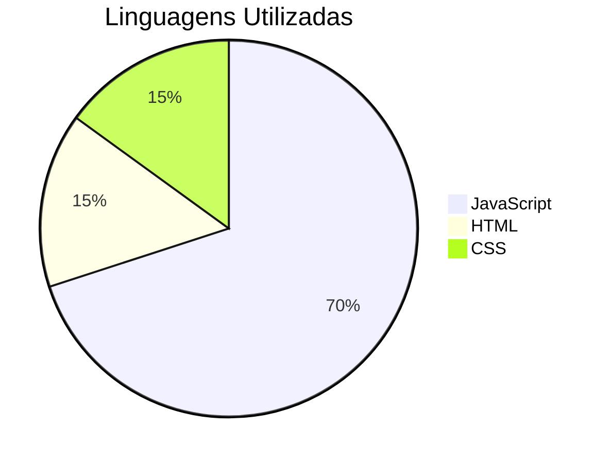

# Descubra Sua Idade

## Descrição do Projeto
Este projeto é uma aplicação React que calcula a sua idade com base na data de nascimento fornecida. É uma ferramenta simples e intuitiva para descobrir quantos anos você tem.

## Instalação

Para rodar este projeto localmente, siga os passos abaixo:

1. Clone o repositório:
  ```bash
  git clone <URL_DO_REPOSITORIO>
  ```
2. Navegue até o diretório do projeto:
  ```bash
  cd descubraSuaIdade
  ```
3. Instale as dependências:
  ```bash
  npm install
  ```
4. Inicie a aplicação:
  ```bash
  npm start
  ```

## Linguagens Utilizadas



## Contato

- WhatsApp: [35984061841](https://wa.me/35984061841)
- LinkedIn: [Rodrigo Marques Tavares](https://www.linkedin.com/in/rodrigo-marques-tavares-9482b4226/)